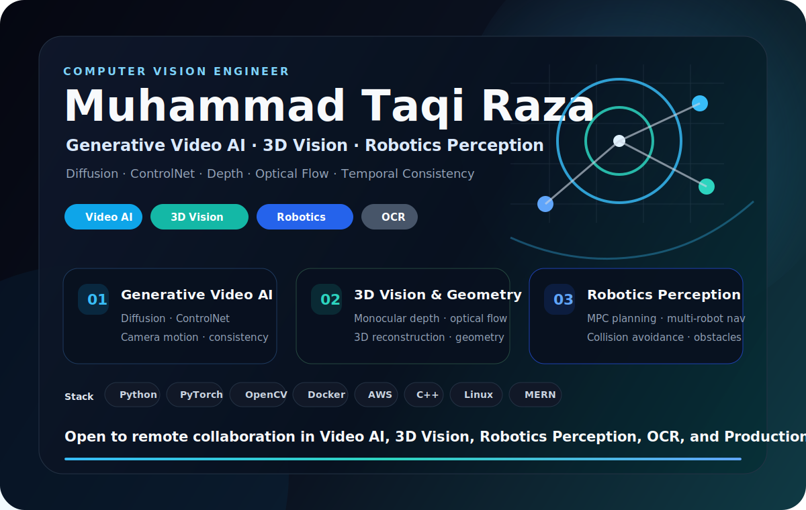

  

  
  

### Profile

I build computer vision systems that turn images and video into reliable signals: depth, motion, geometry, text recognition, temporal consistency, and safe perception outputs. My work connects research-heavy visual modeling with practical deployment through clean pipelines, robust inference, Dockerized services, and AWS-backed delivery.

### Focus Areas

- **Video AI:** camera motion, controllable generation, temporal consistency, inpainting, super-resolution.
- **3D / Geometric Vision:** depth estimation, optical flow, 3D reconstruction, geometry-aware video pipelines.
- **OCR / Recognition:** synthetic data generation, license plate OCR, robustness under blur, low light, smog, and distorted plates.
- **Robotics Perception:** multi-robot navigation, MPC planning, dense-environment collision avoidance across obstacle-rich scenarios.
- **Production ML:** end-to-end CV pipelines, Dockerized inference, AWS deployment, model optimization.

### Selected Work

- **Roll.ai:** monocular video generation pipelines with camera motion, depth, optical flow, temporal consistency, inpainting, super-resolution, and identity preservation.
- **Hazen.ai:** license plate OCR with synthetic data generation and robustness across blur, low light, smog, and distorted plates.
- **Research:** multi-robot navigation with MPC planning and dense-environment collision avoidance across obstacle-rich scenarios.

### Technical Stack

  

  <strong>Open to collaboration</strong> in Computer Vision, Video AI, Robotics Perception, OCR, and 3D Vision.

